# Привет, я Сергей Бурсов 👋

.png)

## О себе

> "Тестирование – это процесс исследования и контроль качества, который состоит из планирования, проектирования, проверки и анализа результатов."

Я QA инженер из Санкт-Петербурга. Каждый день стремлюсь узнавать новые техники и способы тестирования, чтобы моя работа над продуктом приносила качественный результат для конечного пользователя.

---

## 🛠 Мой стек технологий

📈 Профессиональное развитие

---

## 💼 Опыт работы

**QA инженер** — Spirit DSP *(июнь 2023 — сентябрь 2024)*

- Тестирование web, десктоп и мобильных версий приложения VideoMost
- Создание и поддержка тестовой документации
- Составление баг-репортов в YouTrack
- Взаимодействие с разработчиками для улучшения качества продукта

[📄 Смотреть рекомендательное письмо](https://github.com/SergejBursow/sergejbursow/blob/main/My_progress/Spirit_WideoMost/Рекомендация%20-%20Бурсов.pdf)

---

## 📚 Образование

| Курс | Платформа | Период |
|------|-----------|--------|
| [Тестирование web-приложений](https://github.com/SergejBursow/sergejbursow/blob/main/My_progress/Skillbox_web/Certificate.png) | Skillbox | Дек 2022 — Июн 2023 |
| [Postman для тестирования API](https://github.com/SergejBursow/sergejbursow/blob/main/My_progress/Stepik/stepik-certificate-120679-80e6c50_page-0001.jpg) | Stepik | 2023 |

### HTML и CSS
Прошел начальные курсы по верстке для лучшего понимания DevTools

[📁 Код](https://github.com/SergejBursow/sergejbursow/tree/main/My_progress/5.12)

---

## 📋 Мои артефакты

| Артефакт | Ссылка |
|----------|--------|
| 📝 ДСП Товара | [Посмотреть](https://github.com/SergejBursow/sergejbursow/blob/main/My_progress/Skillbox_web/ДСП.jpg) |
| 📱 Декомпозиция моб.приложения | [Посмотреть](https://github.com/SergejBursow/sergejbursow/blob/main/My_progress/Skillbox_web/Декомпозицыя%20моб.приложения.png) |
| ✅ Чек лист | [Посмотреть](https://docs.google.com/spreadsheets/d/1FDOgFy80_GCHsP-IBFw_iR5iXHoxVSKEYJMcj4Jlj8w/edit#gid=0) |

---

## 📊 GitHub статистика

---

## 📫 Связаться со мной

---

